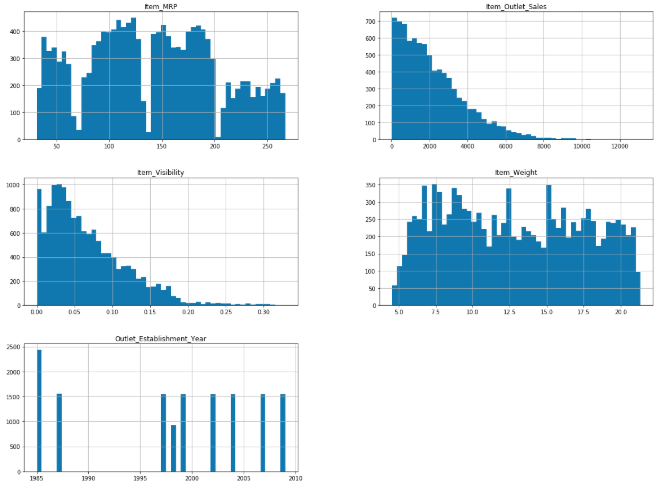
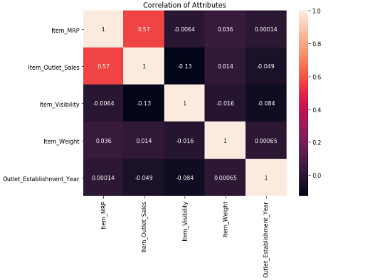
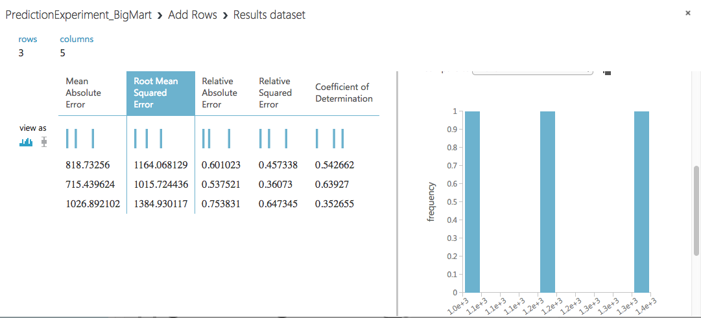
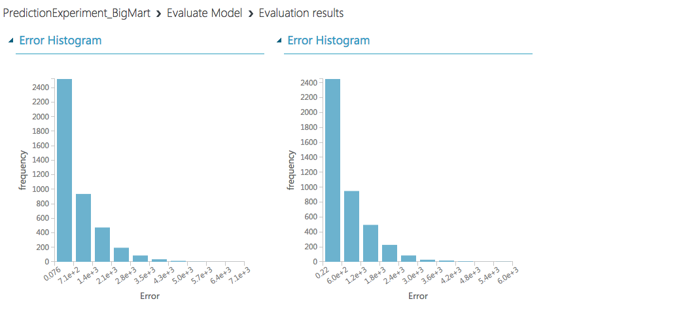
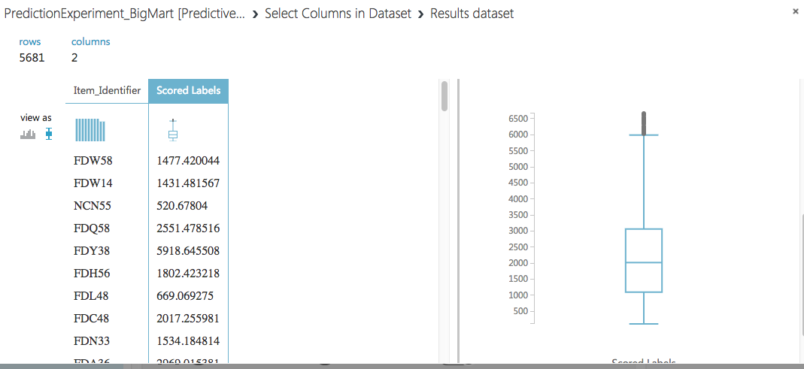
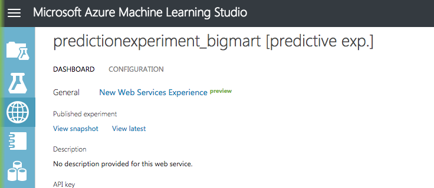
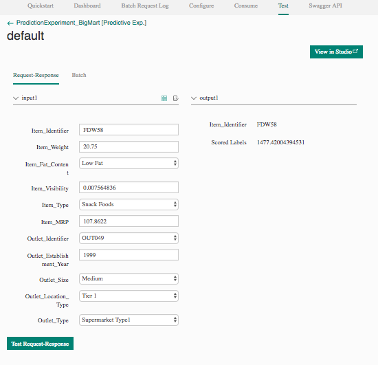
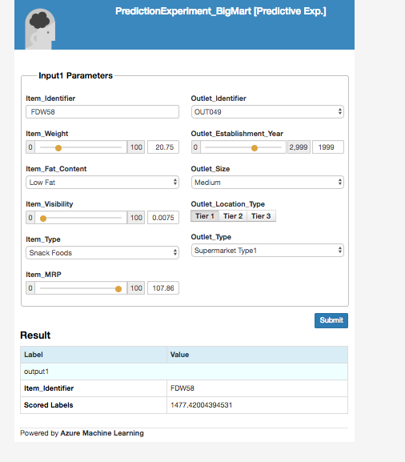
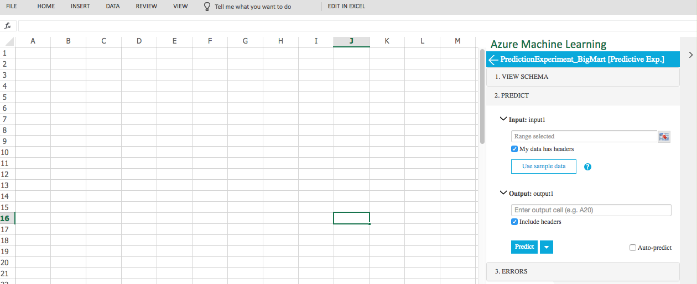

## Report Title - Predictive Model for BigMart Dataset

Working demo [link](https://www.youtube.com/watch?v=xrLto4XPn1o)

# Dataset Details –

This is a dataset collected data from 10 different stores from different cities for 1559 products.

Key features from the dataset are 
* Item_Identifier - Unique product ID
* Item_Weight - Weight of the product
* Item_Fat_content - Product with Fat Content
* Item_MRP - Retail price of the product
* Outlet Identifier - Unique store ID
* Outlet_Size - Size of the store 
* Item_Outlet_Sales - Item Sales price.

BigMart dataset has total of (14204, 12) records and was separately provided with train(8523, 12) and test (5681, 11) dataset. 

# Dataset Details –

It has following 12 attributes with continuous and categorical values with Unique Values –

•Item_Fat_Content has 5 unique values

•Item_Identifier has 1559 unique values

•Item_MRP has 8052 unique values

•Item_Outlet_Sales has  3494 unique values

•Item_Type  has 16 unique values

•Item_Visibility  has 13006 unique values

•Item_Weight has 416 unique values

•Outlet_Establishment_Year  has 9unique values

•Outlet_Identifier  has 10 unique values

•Outlet_Location_Type  has 3 unique values

•Outlet_Size  has 4 unique values

•Outlet_Type  has 4 unique values

# Data Visualization –

•Histogram shows the distribution of data of different variables –

Plotting Histogram from Dataset

•Correlation plot informs about the relation between variables -

# Data Exploration – 
Analyzed and plotted the categorical and continuous feature summaries to see which feature is closely related with target variable. This helped us with deciding which feature are influencing the prediction.

Data Preprocessing –

1.Missing values (2439) of item weight is replaced with mean.

2.Missing values (4016) of outlet size observations, which been replaced with mode.

# Azure ML Studio - 

Azure ML studio provides the GUI interface for creating the Machine Learning Train models and Predictions.
It provides a provision to integrate with Azure Cloud and expose the Web Services

## Train Model - 
Created on Azure ML Studio - 3 Learning Algorithms used 
* Boosted Decision Tree
* Linear Regression 
* HyperTuned Boosted Decision Tree

From the RMSE results, HyperTunned Boosted Decision Tree has provided better results.

Comparing the Hyper-Tune models

## Predictive Model -

Update the Trained model with Test dataset for predicting the Item Outlet Sales data. Verified and updated the data cleaning process which we have implemented for Train dataset.
After converting the categorical data with indicators, we can apply the trained model.

Created predictive model using the above Hypertuned Boosted Decision Tree.

From the score function, have extracted only 2 columns -
* Item Identifer
* Item Outlet Sales

Create the Web service input and Web service Output.

## Web Service Deployment

Once the Prediction model has been executed successfully, it can be deployed as web service from Azure ML Studio.

It will generate the API key, which will be used for Azure Cloud deployment.

It will provide an option to Test web service locally with below options - 
* Click on Test button enabled at the bottom of the screen
* Download the CSV file from the tool to test the Web API with prediction model.

# Azure Cloud deployment

Once the Web Service is created locally, It will create a hyper link with name of the webservice.
Click on the Hyperlink generated on the Name of the webservice.

It will open the web service dashboard for configration and setup the consumtion process with Azure cloud.

It will provide the test tab on the dashboard, where we can provide the inputs and get the prediction values once clicked on Test Request response button.

This step will assure that, the web services are working as expected.

After clicking consume tab from Dashboard, It will display option for Response Request Web Template link.

Copy the request response link generated on the page.
 
Once clicked on the link, it will redirect to Azure cloud configuration using Response Request Web application.

## Azure ML Request-Response Service Web App
In Azure cloud, it need to create - 

* Create the request response service web app
* Create Resource Group
* Add Model Management services
* Click on the URL link generated under resource group
	* Update the Settings with API POST URL 
	* Update the API key generated from Web service from Azure ML studio.

Expose the Web Service from Azure cloud

Click on the below link to access the prediction web service - 
[PredictionWebService](https://predictbigmart.azurewebsites.net/)

Entered the values used to for testing locally, the amount should match so as to see if the service is functioning as expected.

## Batch Mode for Web Service Execution

Download the CSV generated from Azure ML Studio - 
* Open the CSV, it will be open with Web API built in 
* Use Sample data link on the API
* Select the range of columns and provide as input to API
* Select the cell from where the prediction values needs to be displayed.
* Click on Prediction button.

It will generated the prediction values for all the selected Input entries with Item Identifiers.

## Summary 

In this project, below two models have been implemented and hyper-tuned in Azure ML Studio, Once we have the better model, used for prediction on Item Outlet Sales price for all the Items across all the store outlets.
* Boosted Decision Tree
* Linear Regression
* HyperTuned Boosted Decision Tree

Web service has been deployed on Azure Cloud and exposes as to generate the prediction for Item Identifiers.

